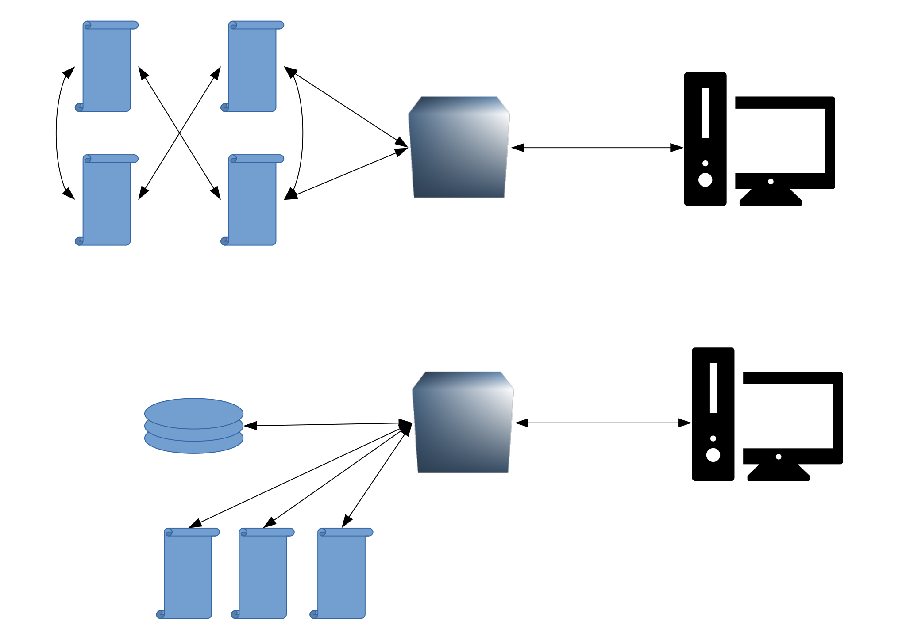

name: inverse
layout: true
class: center, middle, inverse
---
# Progetto COLLEZIONI-AMO

Per la creazione partecipata di un Museo scolastico - reale e virtuale, aperto al territorio - degli strumenti scientifici d’epoca, delle collezioni naturalistiche e delle macchine matematiche del Liceo Scientifico “A.Tassoni” di  Modena


.footnote[a cura di Parmiggiani Marco, Modena <br> Liceo Tassoni - 30/01/2019]

---

layout: false


## Prima, un po' di ripasso.....

--
#### Facciamo una prova

Google Chrome

--

[http://atom.io](http://atom.io)


---

## Il browser

--
Nella barra degli indirizzi si digita un URL (Uniform Resource Locator)
che specifica dove reperire il contenuto desiderato.

--
**Ogni** contenuto accessibile in internet è identificato dal suo URL,
anche applicazioni, immagini, video etc..

---

## Il WWW

.whole-img[]

---


## Il WWW

.whole-img[]

---


## La "TRINITÀ"


---

## La "TRINITÀ"

#### HTML (HyperText Markup Language)
Descrive, in maniera gerarchica, la *struttura* di una pagina web.

--

#### CSS (Cascading Style Sheets)
Specifica le regole che stabiliscono l'*aspetto* degli elementi
di una pagina web.

--

#### JS (Javascript/ECMAScript)
E' un vero e proprio linguaggio di programmazione che consente
di gestire l'interattività delle pagine web, nonché di alterare,
sulla base di eventi specifici, la struttura stessa della pagina.


--
Tutto ciò è scritto su semplici file di testo. Il file può essere unico ma
spesso conviene separarli (*divide et impera...*).


---
## HTML

Ogni file HTML deve iniziare con la *dichiarazione*

```html
<!DOCTYPE html>
```

--

Concetto chiave di un documento HTML è il **tag**: una sequenza di
caratteri delimitati da `<` e `>` che specifica il tipo di *elemento* che
si vuole inserire.

Quasi tutti i tag vanno *aperti* e *chiusi*. Il contenuto dei tag va inserito
tra il tag di apertura e il tag di chiusura. Il tag di chiusura si distingue
per la presenza della `/`.

--
```html
<html>  </html>
```
--
Il un tag può contenere testo e/o altri tag.


---
## Struttura di base di un file HTML


---

## Un file HTML minimale


```html
<!DOCTYPE HTML>
<html>
    <head>
        <!-- qui ci vanno informazioni sulla pagina //-->
    </head>
    <body>
        Ciao mondo!
    </body>
</html>
```

L'*indentazione* consente ad un essere umano di visualizzare meglio
la struttura del documento.


---
## Volendo dare un titolo...

```html
 ...<head>
        <title>La mia fantastica pagina web</title>
    </head>...
```


---

## Risorse esterne

#### In italiano
[www.html.it](www.html.it)


#### In inglese
[w3schools.com](www.w3schools.com)
