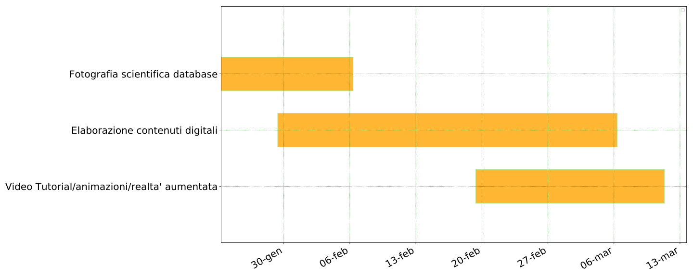
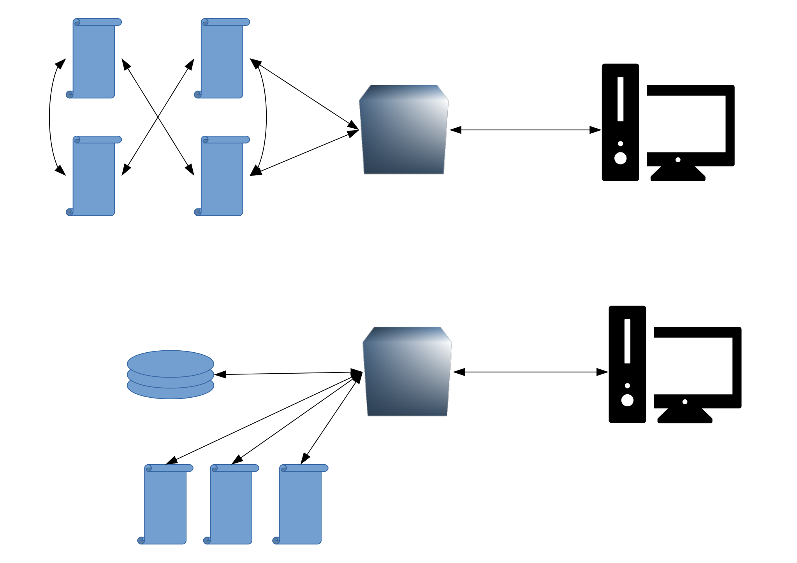
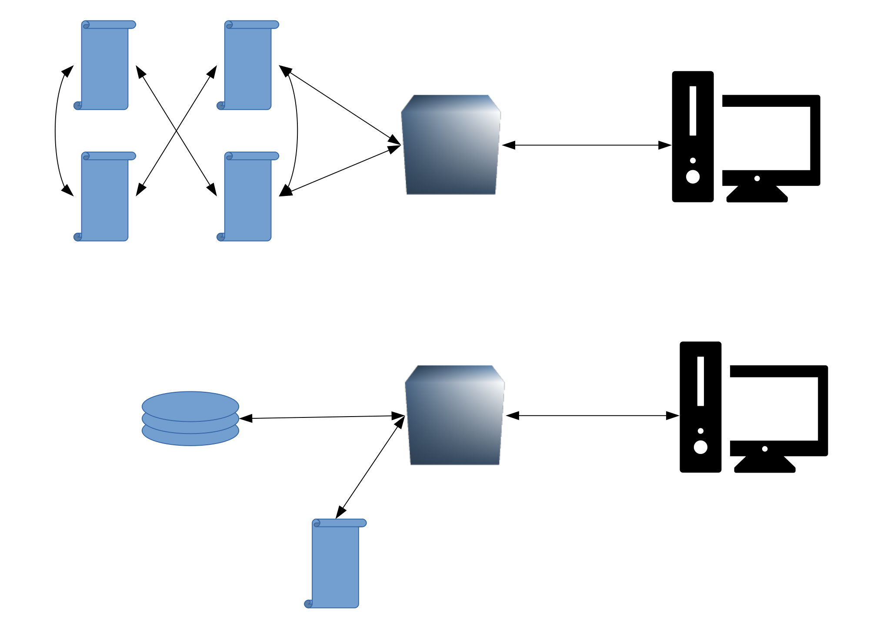
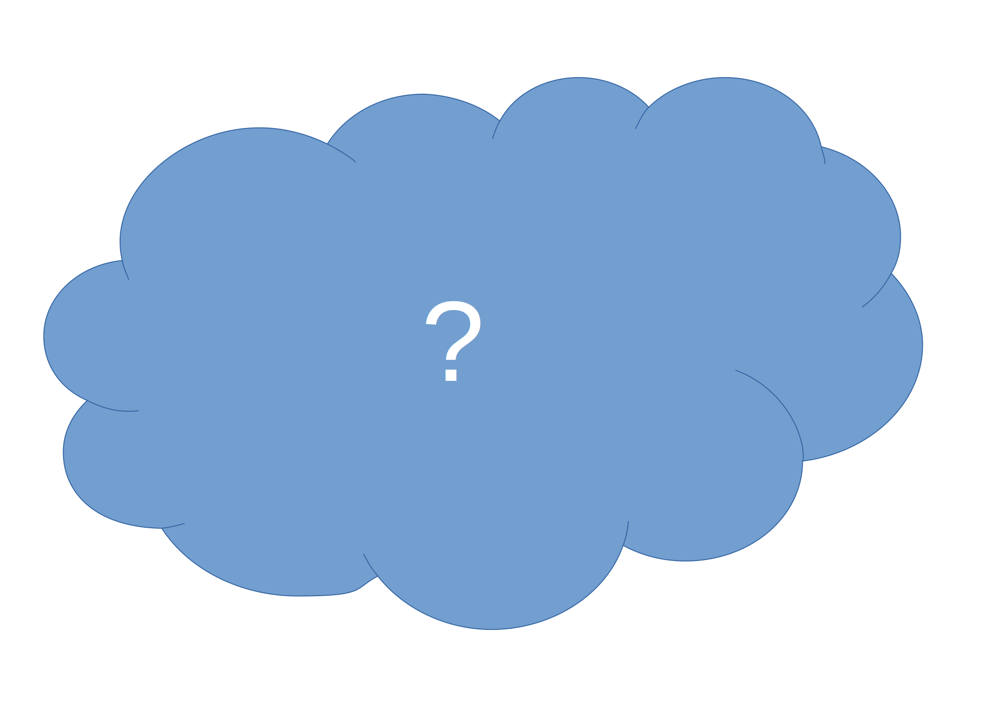

name: inverse
layout: true
class: center, middle, inverse
---
# Progetto COLLEZIONI-AMO

Per la creazione partecipata di un Museo scolastico - reale e virtuale, aperto al territorio - degli strumenti scientifici d’epoca, delle collezioni naturalistiche e delle macchine matematiche del Liceo Scientifico “A.Tassoni” di  Modena

.footnote[a cura di Parmiggiani Marco, Modena   Liceo Tassoni - 16/01/2019]

---

layout: false

## Progetto COLLEZIONI-AMO

### Modulo 1: Il museo reale
### Modulo 2: Il museo virtuale 2.0
### Modulo 3: Restauro e digitalizzazione degli strumenti scientifici
### Modulo 4: Il Museo e il territorio - comunicazione scientifica

---

## Progetto COLLEZIONI-AMO

### Modulo 1: Il museo reale
### .highlight[Modulo 2: Il museo virtuale 2.0]
### Modulo 3: Restauro e digitalizzazione degli strumenti scientifici
### Modulo 4: Il Museo e il territorio - comunicazione scientifica

---
## Progetto COLLEZIONI-AMO

#### MODULO 1 – Il Museo reale:
* sottomodulo: strumenti di fisica  (a.s. 2018-19);
* sottomoduli:
    - collezioni naturalistiche (a.s. 2019-20);
    - macchine matematiche (a.s. 2019-20)

##### Materiali (già in dotazione alla scuola o da acquistare):
* Strumenti storici di Fisica (a.s. 2018-19)
* Collezioni naturalistiche e macchine matematiche(a.s. 2019-20)
* Computer portatili (da acquistare)
---
## Progetto COLLEZIONI-AMO

#### MODULO 1 – Il Museo reale:

##### Luogo fisico di esposizione: Liceo Tassoni (corridoi 1° piano, piano interrato?)
##### Progettazione multidisciplinare:
* Ispezione, analisi, prima catalogazione e schedatura dei materiali (studenti+esperto+tutor)
* Ricerca d’archivio e sul web (studenti+esperto+tutor)
* Ricollocazione dei materiali (studenti+esperti+tutor)

##### Soggetti coinvolti:
* Studenti (26) e docenti della scuola (tutor, esperto interno)
* Provincia di Modena (proprietario dei materiali, tutor A.S.L.)
*  Esperti esterni (eventuali): tecnici, informatici, docenti universitari,...

##### Tempi (per l’a.s. 2018-19): impegno orario per ogni studente: 30 ore (10 incontri extra-curr. di 3 ore

---
## Progetto COLLEZIONI-AMO

#### MODULO 2 – Il Museo Virtuale 2.0:
* sottomodulo strumenti di fisica (a.s. 2018-19)
* sottomoduli:
    - collezioni naturalistiche (a.s. 2019-20)
    - macchine matematiche (a.s. 2019-20)

##### Materiali (già in dotazione alla scuola o da acquistare):
* Strumenti storici di Fisica (a.s. 2018-19)
* Collezioni naturalistiche e macchine matematiche (a.s. 2019-20)
* Computer portatili (da acquistare)
* Macchina fotografica e set fotografico

---

## Progetto COLLEZIONI-AMO

#### MODULO 2 – Il Museo Virtuale 2.0:
* .highlight[sottomodulo strumenti di fisica (a.s. 2018-19)]
* sottomoduli:
    - collezioni naturalistiche (a.s. 2019-20)
    - macchine matematiche (a.s. 2019-20)

##### Materiali (già in dotazione alla scuola o da acquistare):
* Strumenti storici di Fisica (a.s. 2018-19)
* Collezioni naturalistiche e macchine matematiche (a.s. 2019-20)
* Computer portatili (da acquistare)
* Macchina fotografica e set fotografico

---
## Progetto COLLEZIONI-AMO

#### MODULO 2 – Il Museo Virtuale 2.0:

##### Progettazione multidisciplinare:
* Sito web multilingua (collegato al sito della scuola)
* schede in formato digitale
* fotografie (formazione su fotografia scientifica)
* animazioni web (formazione su progettazione web)
* Archiviazione digitale dei materiali prodotti in relazione alle attività del  museo (conferenze, lezioni, tutorial di esperienze, animazioni, ...)

##### Soggetti coinvolti:
* Studenti (24) e docenti della scuola (tutor, esperto interno)
* Provincia di Modena (proprietario dei materiali, tutor A.S.L.)
* Esperti esterni (eventuali): tecnici, informatici, docenti universitari,...

##### Tempi (per l’a.s. 2018-19):  impegno orario per ogni studente: 30 ore (10 incontri extra-curr. di 3 ore)

---
## Progetto COLLEZIONI-AMO

#### MODULO 3 - Restauro e digitalizzazione strumenti scientifici(a.s. 2018-19); Manutenzione/produzione  macchine matematiche (a.s. 2019-20)

##### Materiali (già in dotazione alla scuola o da acquistare):
* Strumenti storici di Fisica (a.s. 2018-19)
* Macchine matematiche (a.s. 2019-20)
* Computer portatili, sensori e materiale elettronico (da acquistare)

##### Progettazione multidisciplinare:
* Verifica funzionalità + messa a norma
* Restauro 2.0: digitalizzazione (applicazione di sensori, interfaccia digitale)
* Manutenzione ordinaria, ripristino
* Produzione di nuovo materiale (macchine matematiche, a.s. 2019-20)

---
## Progetto COLLEZIONI-AMO

#### MODULO 3 - Restauro e digitalizzazione strumenti scientifici(a.s. 2018-19); Manutenzione/produzione  macchine matematiche (a.s. 2019-20)

##### Soggetti coinvolti:
* Studenti (26) e docenti della scuola (tutor)
* Provincia di Modena (proprietario dei materiali, tutor A.S.L.)
* Esperti esterni: tecnici, informatici, docenti universitari,…
* Rete di enti pubblici esterni per competenze e conoscenze (elettronica, informatica,..): Istituti tecnici del territorio, Università , Innovation lab (Palestra Digitale MakeitModena),...

##### Tempi (per l’a.s. 2018-19): impegno orario per ogni studente: 30 ore (10 incontri extra-curr. di 3 ore)

---

## Progetto COLLEZIONI-AMO

#### MODULO 4 – Il Museo e il territorio: Comunicazione scientifica

##### Progettazione multidisciplinare:
* Brevi conferenze  a tema periodiche (condotte da studenti e/o docenti tutor) rivolte al territorio (studenti delle scuole medie, genitori,...)
* Visite guidate (anche in lingua) alle collezioni condotte da studenti
* Sostegno all’attività didattica curricolare (tutoring da parte di studenti formati nel progetto a studenti del biennio in attività laboratoriali,..)
* Produzione di materiale didattico digitale (Open Educational Resources)
* Gestione del sito web dedicato (vedi modulo 2), promozione sul territorio delle iniziative del Museo
* Attività editoriale: web (blog,  video, tutorial, ..) e cartacea  (manualistica ,..) (formazione all’editoria web e alla divulgazione scientifica)
---

## Progetto COLLEZIONI-AMO

#### MODULO 4 – Il Museo e il territorio: Comunicazione scientifica

##### Soggetti coinvolti:
* Studenti (26) e docenti della scuola (tutor)
* Esperti esterni (esperti di comunicazione scientifica, docenti universitari,…)
* Rete di enti pubblici esterni per competenze e conoscenze (elettronica, informatica,..)
* Istituti tecnici del territorio
* Università (Fisica, Matematica, Ingegneria..)
* Innovation lab (Palestra Digitale MakeitModena,..)

##### Tempi: per l’a.s. 2018-19 Impegno orario per ogni studente: 30 ore (10 incontri extracurricolari di 3 ore)

---

## Progetto COLLEZIONI-AMO

#### Tempistica
* Durata complessiva: 2 anni (aa.ss. 2018-19, 2019-20)
* Impegno orario per singolo modulo (per ogni studente): 30 ore
 
#### Finanziamento:
* per l’a.s. 2018-19: Avviso pubblico per il potenziamento dell’educazione al patrimonio culturale, artistico, paesaggistico (n.4427 del 02-05-2017) Fondi Strutturali Europei – Programma Operativo Nazionale (PON) “Per la Scuola, competenze e ambienti per l’apprendimento” 2014-2020 Asse I – Istruzione – Fondo Sociale Europeo (FSE) - Obiettivo Specifico 10.2 - Azione 10.2.5
* per l’a.s. 2019-20: Enti locali, fondazioni, (?)
 
#### Ipotesi di scalabilità - sviluppi futuri:
* Diffusione ad altre scuole -> Rete di scuole
* Formazione di un centro museale scientifico modenese in cui far confluire le collezioni storiche delle scuole
* Coinvolgimento degli studenti e dei docenti della scuola in un possibile futuro polo tecnologico/culturale cittadino

---

## Modulo 2 - Il museo virtuale

.whole-center-img[]

---

## Modulo 2 - Il museo virtuale

.whole-img[]

---

## Modulo 2 - Il museo virtuale

.whole-img[]

---

## Modulo 2 - Il museo virtuale

.whole-img[]

---

## Modulo 2 - Il museo virtuale - Risorse

### Musei scolastici

- [Liceo Foscarini (Venezia)](http://museo.liceofoscarini.it/index.html) Anche in inglese
- [Liceo Villari (Napoli)](https://www.liceovillari.it/museo-di-fisica/) catalogo
- [Liceo Petrarca (Padova)](http://www.liceopetrarcats.it/il-liceo-petrarca/museo-di-fisica.html)

### Musei universitari
- [Università di Padova](https://musei.unipd.it/it/fisica)
- [Università di Bologna](https://sma.unibo.it/it)
- [Università di Urbino](http://physlab.uniurb.it/Museum.html)

### Musei della scienza
- [Science museum](https://collection.sciencemuseum.org.uk/)
- [Museo della scienza](www.museoscienza.org)

---

## Modulo 2 - Il museo virtuale

### Scheda di lavoro

[link](https://drive.google.com/file/d/1Qw_90IEbudp8j4S6ZDvOA3lXyEBzOY_z/view?usp=sharing)

[proposta](https://drive.google.com/file/d/1XFlbBQmW8dsI3-renRlNx3SItlydeYx-/view?usp=sharing)

--

### Piano di lavoro
* esplorazione contenuti digitali (40 min.)
* elaborazione della proposta (40 min.)
* presentazione della proposta (5 min. a gruppo)

---
